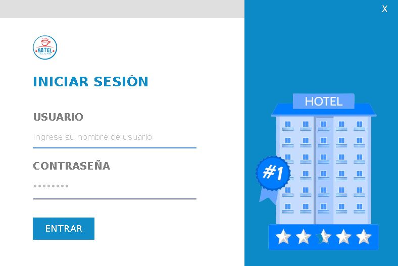
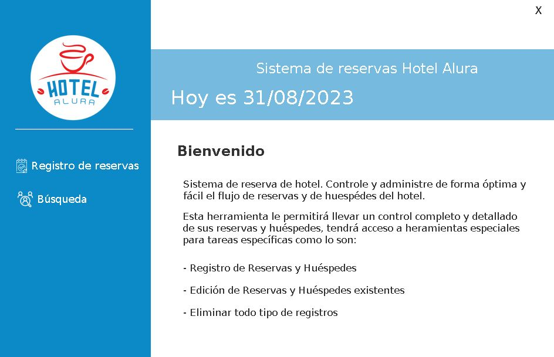
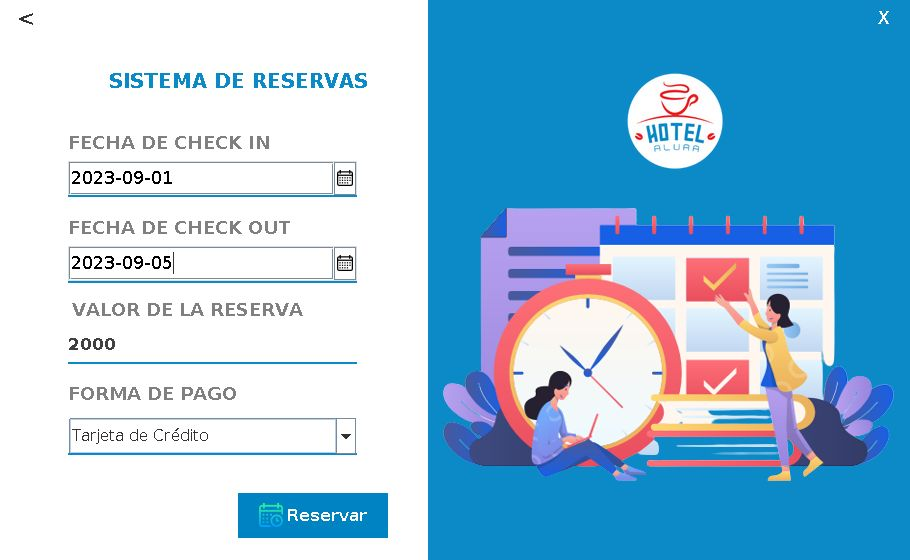
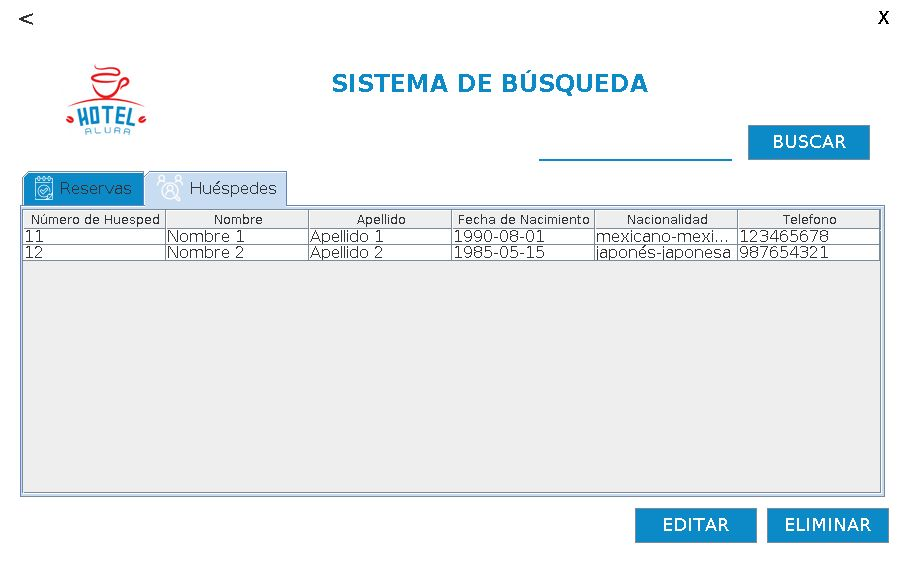

# Hotel Alura

Aplicación de escritorio que simula el sistema de reservas de un hotel llamado Alura. La aplicación implementa el registro de usuarios, de sus reservas, así como la consulta de esta información haciendo el uso de la conexión a una base de datos para la persistencia de la información.

## Tecnologías Usadas

* Java
* Swing (librería de Java)
* Hibernate
* MySQL

### Componentes necesarios para el funcionamiento de la aplicación

* MySqlConnector
* Jcalendar
* Plugin WindowBuilder

## Componentes de la aplicación

La aplicación implementa un sistema de login en el que el usuario de la aplicación deberá hacer login con el objetivo de acceder a las funcionalidades.

El sistema implementa dos opciones para la aplicación, el registro del huésped y su reserva en el sistema del hotel, y la opción de la visualización re las reservas y huéspedes:

Si seleccionamos "Registro de reservas" se nos abrirá una ventana en la cual registraremos la reserva y posteriormente una ventana adicional donde se nos pedirá registrar al usuario de la reserva.

Por el otro lado, si seleccionamos "Búsqueda" se abrirá una ventana en la cual se visualizaran las reservas y los huéspedes en el sistema del hotel.

En esta ventana se le permite al usuario el poder buscar una reserva por su id, a un huésped por su apellido, así como el poder modificar los valores tanto de los huéspedes como de las reservas (exceptuando los id de las reservas y de los huéspedes) y eliminar cualquier huésped o reserva. ADVERTENCIA: Si se borra un huésped se borrará de igual forma las reservas a su nombre, manéjese con precaución.

## Despliegue del proyecto

Para el despliegue del proyecto se recomienda usar él IDE Eclipse, debido a la compatibilidad del plugin WindowBuilder. Aunque el proyecto cuente con varias clases main (por el uso del plugin WindowBuilder) el programa debe iniciarse con la clase MenuPrincipal.
